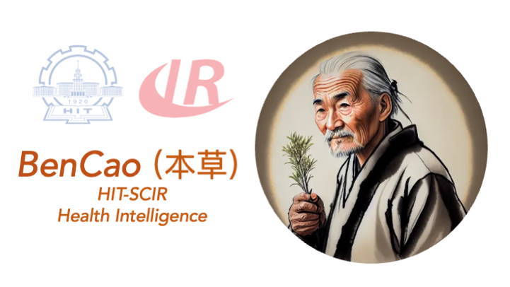

[**中文**](./README.md) | [**English**](./README_EN.md)
<p align="center" width="100%">
<a href="https://github.com/SCIR-HI/Huatuo-Llama-Med-Chinese/" target="_blank"></a>
</p>
# BenCao (original name: HuaTuo): Instruction-tuning Large Language Models With Chinese Medical Knowledge

[](https://github.com/SCIR-HI/Huatuo-Llama-Med-Chinese/blob/main/LICENSE) [](https://www.python.org/downloads/release/python-390/)

This repo open-sources a series of instruction-tuned large language models with Chinese medical instruction datasets, including LLaMA、Alpaca-Chinese、Bloom、Huozi. 

We constructed a Chinese medical instruct-tuning dataset using medical knowledge graphs, medical literatures and the GPT3.5 API, and performed instruction-tuning on various base models with this dataset, improving its question-answering performance in the medical field.


## News
**[2023/08/07] 🔥🔥 Released a model instruction-tuned based on [Huozi](https://github.com/HIT-SCIR/huozi), resulting in a significant improvement in model performance. 🔥🔥**

[2023/08/05] The "BenCao" model was presented as a poster at the CCL 2023 Demo Track.

[2023/08/03] SCIR Lab open-sourced the [Huozi](https://github.com/HIT-SCIR/huozi) general question-answering model. Everyone is welcome to check it out! 🎉🎉

[2023/07/19] Released a model instruction-tuned based on [Bloom](https://huggingface.co/bigscience/bloom-7b1).

[2023/05/12] The model was renamed from "Huatuo" to "BenCao".

[2023/04/28] Released a model instruction-tuned based on the [Chinese-Alpaca](https://github.com/ymcui/Chinese-LLaMA-Alpaca).

[2023/04/24] Released a model instruction-tuned based on LLaMA with medical literature.

[2023/03/31] Released a model instruction-tuned based on LLaMA with a medical knowledge base.


## A Quick Start
Firstly, install the required packages. It is recommended to use Python 3.9 or above

```
pip install -r requirements.txt
```

For all base models, we adopted the semi-precision base model LoRA fine-tuning method for instruction fine-tuning training, in order to strike a balance between computational resources and model performance.

### Base models
 - [Huozi1.0](https://github.com/HIT-SCIR/huozi), Bloom-7B-based Chinese QA model
 - [Bloom-7B](https://huggingface.co/bigscience/bloomz-7b1)
 - [Alpaca-Chinese-7B](https://github.com/ymcui/Chinese-LLaMA-Alpaca), LLaMA-based Chinese QA model
 - [LLaMA-7B](https://huggingface.co/decapoda-research/llama-7b-hf)


### LoRA weight download
LORA weights can be downloaded through Baidu Netdisk or Huggingface.

1. 🔥LoRA for Huozi 1.0
  - with the medical knowledge base and medical QA dataset [BaiduDisk](https://pan.baidu.com/s/1BPnDNb1wQZTWy_Be6MfcnA?pwd=m21s)
2. LoRA for Bloom
 - with the medical knowledge base and medical QA dataset [BaiduDisk](https://pan.baidu.com/s/1jPcuEOhesFGYpzJ7U52Fag?pwd=scir) and [Hugging Face](https://huggingface.co/lovepon/lora-bloom-med-bloom)
3. LoRA for Chinese Alpaca
 - with the medical knowledge base [BaiduDisk](https://pan.baidu.com/s/16oxcjzXnXjDpL8SKihgNxw?pwd=scir) and [Hugging Face](https://huggingface.co/lovepon/lora-alpaca-med)
 - with the medical knowledge base and medical literature [BaiduDisk](https://pan.baidu.com/s/1HDdK84ASHmzOFlkmypBIJw?pwd=scir) and [Hugging Face](https://huggingface.co/lovepon/lora-alpaca-med-alldata)
4. LoRA for LLaMA
 - with the medical knowledge base [BaiduDisk](https://pan.baidu.com/s/1jih-pEr6jzEa6n2u6sUMOg?pwd=jjpf) and [Hugging Face](https://huggingface.co/thinksoso/lora-llama-med)
 - with medical literature [BaiduDisk](https://pan.baidu.com/s/1jADypClR2bLyXItuFfSjPA?pwd=odsk) and [Hugging Face](https://huggingface.co/lovepon/lora-llama-literature)


Download the LORA weight file and extract it. The format of the extracted file should be as follows:

```
**lora-folder-name**/
  - adapter_config.json   # LoRA configuration
  - adapter_model.bin   # LoRA weight
```

We also trained a medical version of ChatGLM: [ChatGLM-6B-Med](https://github.com/SCIR-HI/Med-ChatGLM) based on the same data.


### Infer
We provided some test cases in `./data/infer.json`, which can be replaced with other datasets. Please make sure to keep the format consistent.

Run the infer script

```
#Based on medical knowledge base
bash ./scripts/infer.sh

#Based on medical literature
#single-epoch
bash ./scripts/infer-literature-single.sh

#multi-epoch
bash ./scripts/infer-literature-multi.sh
```

The code for the infer.sh script is as follows. Please replace the base model base_model, the LoRA weights lora_weights, and the test dataset path instruct_dir before running

	python infer.py \
			    --base_model 'BASE_MODEL_PATH' \
			    --lora_weights 'LORA_WEIGHTS_PATH' \
			    --use_lora True \
			    --instruct_dir 'INFER_DATA_PATH' \
			    --prompt_template 'TEMPLATE_PATH'
		    

The prompt template is relevant to the model as follows: 

| Huozi&Bloom                      | LLaMA&Alpaca                                                                          |                                       
|:------------------------------|:--------------------------------------------------------------------------------------|
| `templates/bloom_deploy.json` | with the medical knowledge base`templates/med_template.json` <br>  with the medical literature`templates/literature_template.json` |


other reference in `./scripts/test.sh`

	
## Methodology
The base model has limited effectiveness in medical question-answering scenarios. Instruction-tuning is an efficient method to give the base model the ability to answer human questions
	    
### Dataset construction
#### Medical knowledge base
We used both publicly available and self-built Chinese medical knowledge bases, with a primary reference to [cMeKG](https://github.com/king-yyf/CMeKG_tools). The medical knowledge base is built around diseases, drugs, and diagnostic indicators, with fields including complications, risk factors, histological examinations, clinical symptoms, drug treatments, and adjuvant therapies. An example of the knowledge base is shown below:


```
{"中心词": "偏头痛", "相关疾病": ["妊娠合并偏头痛", "恶寒发热"], "相关症状": ["皮肤变硬", "头部及眼后部疼痛并能听到连续不断的隆隆声", "晨起头痛加重"], "所属科室": ["中西医结合科", "内科"], "发病部位": ["头部"]}
```
We used the GPT3.5 API to build a Question-Answer dataset around a medical knowledge base, with multiple prompts to fully leverage the knowledge.

An example of the training dataset for instruct-tuning is shown below:


```
"问题：一位年轻男性长期使用可卡因，突然出现胸痛、呕吐、出汗等症状，经检查发现心电图反映心肌急性损伤，请问可能患的是什么疾病？治疗方式是什么？"
回答: 可能患的是心肌梗塞，需要进行维拉帕米、依普利酮、硝酸甘油、ß阻滞剂、吗啡等药物治疗，并进行溶栓治疗、低分子量肝素、钙通道阻滞剂等辅助治疗。此外需要及时停用可卡因等药物，以防止病情加重。"
```

We provided a training dataset for the model, consisting of more than eight thousand entries. It should be noted that although knowledge has been incorporated into the construction of the training set, there are still errors and imperfections. We will use better strategies to iteratively update the dataset in the future.

The quality of the dataset for instruct-tuning is still limited. We will continue to iterate and improve it. Meanwhile, the medical knowledge base and dataset construction code are still being organized and will be released once completed.

#### Medical literature
In addition, we collected Chinese medical literature on liver cancer in 2023, and used the GPT3.5 interface to collect multiple rounds of question-and-answer data around the medical literature. We provide 1k training examples in `./data_literature/liver_cancer.json`. At present, the quality of training samples is still limited. In the future, we will further iterate the data and release it in the form of `public dataset`. An example of a training sample is as follows:

<p align="center" width="100%">

<a href="https://github.com/SCIR-HI/Huatuo-Llama-Med-Chinese/" target="_blank"></a>

</p>

At present, we only open model parameters trained for the single disease "liver cancer". In the future, we plan to release a medical dialogue dataset incorporating medical literature conclusions, and plan to train models for 16 diseases related to "liver, gallbladder and pancreas".

### Finetune
To fine-tune LLaMA with your own dataset, please construct your dataset following the format of `./data/llama_data.json` and run the finetune script.

```
bash ./scripts/finetune.sh
```


## Training details
### GPU resource
We trained the model on an A100-SXM-80GB for a total of 10 epochs, which took approximately 2 hours and 17 minutes. With a batch size of 128, the GPU memory usage was around 40GB. We expect that GPU with 24GB or more of memory, such as the 3090/4090, will be able to support the model well, and the batch size can be adjusted based on the size of the GPU memory.


### Experiments
Parameter settings and details training process can be found in the wandb log:
https://wandb.ai/thinksoso/llama_med/runs/a5wgcnzt/overview?workspace=user-thinksoso

## Comparison of models

Note: test in March 2023.

| Input入 | Llama output  | Alpaca output | HuaTuo output |
|:------------- |:---------------| :-------------|:-------------|
|小张最近感觉身体不适，出现心悸、气促等症状。体检发现心脏扩大、搏动减弱。|问题：小张最近感觉身体不适，出现心悸、气促等症状。体检发现心脏扩大、搏动减弱。| 最近，小张一直感觉身体不舒服，有心烦意乱、呼吸急促等症状。体格检查显示心脏增大，肌肉无力。|**小张可能患有心肌炎，建议尽快到医院进行检查和治疗。治疗方案包括药物治疗和手术治疗。**|
|麻风病和儿童哮喘的病因是否一致？|儿童哮喘和麻风病的病因是一致，但是儿童哮喘和麻风病的病因不一致|是的，哮喘和儿童喘息有相似的原因。| **不一致，麻风病的病因是麻风杆菌感染，而儿童哮喘的病因是喂养不良、吸烟等因素。**|
|一位患者出现了持续性的胀痛和黄疸，经影像学检查后确诊为肝胆管结石病，应该采取哪些治疗方案？|肝胆管结石病患者应该采取哪些治疗方案？|患者应接受手术和化疗相结合的治疗。| **针对肝胆管结石病，治疗方案包括手术治疗、药物治疗和辅助治疗等。具体治疗方案需要根据患者的具体情况而定。**|

##FAQs

1. 	Q: Why was it renamed to "BenCao"?
	
	A: For naming consistency with the SCIR large language model series, the name of the Chinese medical model has been renamed to "BenCao".

2. 	Q: Why "Huatuo(华驼)" instead of "Huatuo(华佗)"?
	
	A: We chose the name "Huatuo(华驼)" because our base model, LLaMA(美洲驼), and Alpaca(羊驼). Inspired by their names and a pun on the name "tuo驼" & "tuo佗", we named our model "Huatuo(华驼)".

3. 	Q: Does it use Chinese traditional medicine theories or data?
	
	A: Not at the moment.

4.	Q: The results from the model vary and are limited in effectiveness.

	A: Due to the diversity considerations of the generative model, results may vary with multiple runs. The current open-source model, owing to the limited Chinese corpus in LLaMA and Alpaca, and a rather coarse way of knowledge integration, may yield inconsistent results. Please try the bloom-based and character-based models.
5. Q: The model cannot run or the inferred content is completely unacceptable.
	
	A: Please ensure that you've installed the dependencies from the requirements, set up the CUDA environment and added the environment variables, and correctly input the downloaded model and Lora's storage location. Any repetition or partial mistakes in the inferred content are occasional issues with the llama-based model and relate to LLaMA's ability in Chinese, training data scale, and hyperparameter settings. Please try the new character-based model. If there are severe issues, please describe in detail the filename, model name, Lora configuration, etc., in an issue. Thank you all.
Q: Among the released models, which one is the best?
A: Based on our experience, the character-based model seems to perform relatively better.


## Contributors

This project was founded by the Health Intelligence Group of the Research Center for Social Computing and Information Retrieval at Harbin Institute of Technology, including [Haochun Wang](https://github.com/s65b40), [Yanrui Du](https://github.com/DYR1), [Chi Liu](https://github.com/thinksoso), [Rui Bai](https://github.com/RuiBai1999), [Nuwa Xi](https://github.com/rootnx), [Yuhan Chen](https://github.com/Imsovegetable), [Zewen Qiang](https://github.com/1278882181), [Jianyu Chen](https://github.com/JianyuChen01), [Zijian Li](https://github.com/FlowolfzzZ) supervised by Associate Professor [Sendong Zhao](http://homepage.hit.edu.cn/stanzhao?lang=zh), Professor Bing Qin, and Professor Ting Liu.


## Acknowledgements

This project has referred the following open-source projects. We would like to express our gratitude to the developers and researchers involved in those projects.

- Facebook LLaMA: https://github.com/facebookresearch/llama
- Stanford Alpaca: https://github.com/tatsu-lab/stanford_alpaca
- alpaca-lora by @tloen: https://github.com/tloen/alpaca-lora
- CMeKG https://github.com/king-yyf/CMeKG_tools
- 文心一言 https://yiyan.baidu.com/welcome The logo of this project is automatically generated by Wenxin Yiyan.

## Disclaimer
The resources related to this project are for academic research purposes only and strictly prohibited for commercial use. When using portions of third-party code, please strictly comply with the corresponding open source licenses. The content generated by the model is influenced by factors such as model computation, randomness, and quantization accuracy loss, and this project cannot guarantee its accuracy. The vast majority of the dataset used in this project is generated by the model, and even if it conforms to certain medical facts, it cannot be used as the basis for actual medical diagnosis. This project does not assume any legal liability for the content output by the model, nor is it responsible for any losses that may be incurred as a result of using the related resources and output results.


## Citation
If you use the data or code from this project, please declare the reference:

```
@misc{wang2023huatuo,
      title={HuaTuo: Tuning LLaMA Model with Chinese Medical Knowledge}, 
      author={Haochun Wang and Chi Liu and Nuwa Xi and Zewen Qiang and Sendong Zhao and Bing Qin and Ting Liu},
      year={2023},
      eprint={2304.06975},
      archivePrefix={arXiv},
      primaryClass={cs.CL}
}
```


